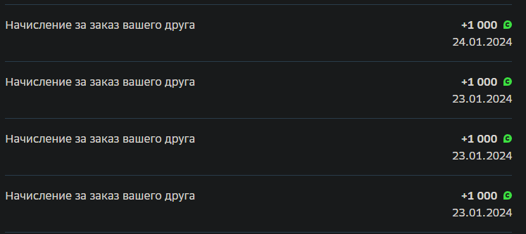
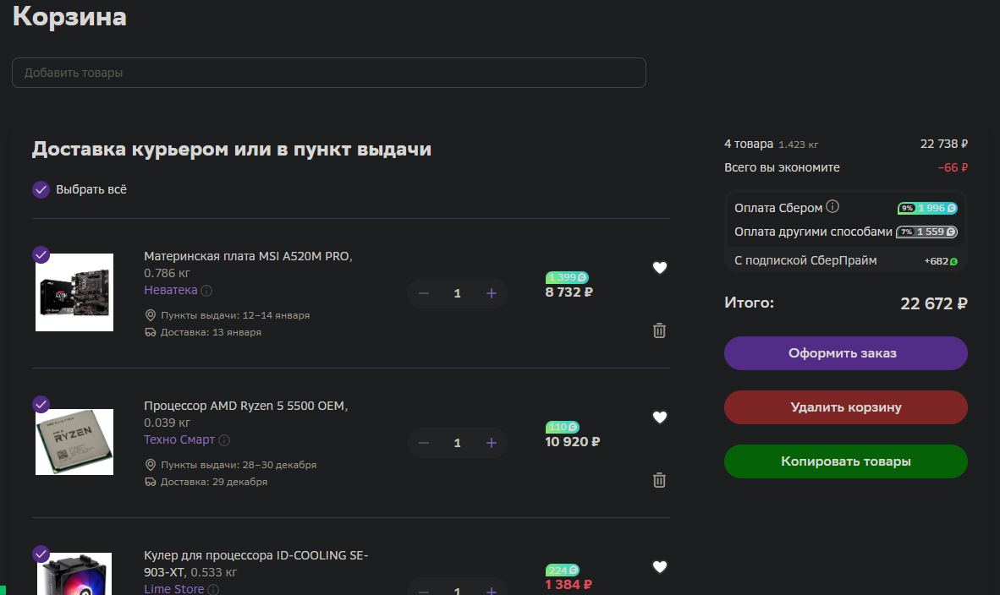
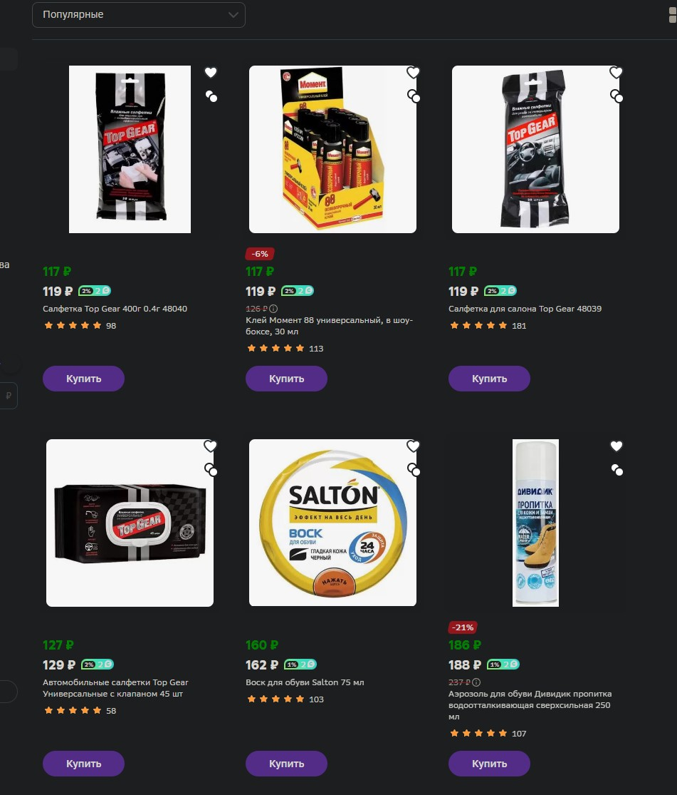

# Как пользоваться
1. Уставновить userscript менеджер для вашего браузера
    * [Tampermonkey](https://www.tampermonkey.net/)
    * [Violentmonkey](https://violentmonkey.github.io/)
2. Нажать на "**Установить**" у нужного вам скрипта

## Megamarket Bonus Date
[Установить](https://github.com/xob0t/MM-tools/raw/main/mm_ref_bouns_date.user.js)

Показывает дату начисления реферальных бонусов

## Megamarket Cart Tools
[Установить](https://github.com/xob0t/MM-tools/raw/main/mm_cart_tools.user.js)

Добавляет инструменты для работы с корзинами.

Позволяет:
* Копировать все товары из корзины как json строку
* Добавлять товары в корзину из json строки
* Удалять все товары из корзины одной кнопкой

## Megamarket Price Calculator
[Установить](https://github.com/xob0t/MM-tools/raw/main/mm_bonus_calc.user.js)

Отображение цен с вычетом бонусов и сортировка по ним.

